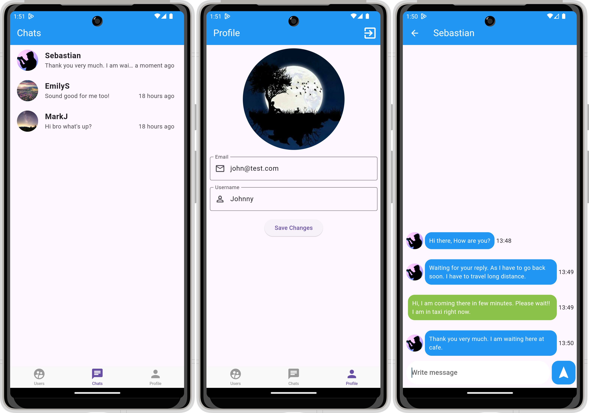

# LiveChat App

## Welcome/Sign In/Users Pages
 
## Chats/Profile/Chat Pages
 

# Built With 

- [Flutter&Dart](https://docs.flutter.dev/get-started/codelab)
- [Basic Widgets](https://docs.flutter.dev/ui/widgets/basics)
- [Material Component Widgets](https://docs.flutter.dev/ui/widgets/material)
- [Async Widgets](https://docs.flutter.dev/ui/widgets/async)
- [Firebase](https://firebase.google.com)
- [Firebase Core](https://pub.dev/packages/firebase_core)
- [Firebase Auth](https://pub.dev/packages/firebase_auth)
- [Cloud Firestore](https://pub.dev/packages/cloud_firestore)
- [Firebase Storage](https://pub.dev/packages/firebase_storage)
- [Get It](https://pub.dev/packages/get_it)
- [Provider](https://pub.dev/packages/provider)
- [Google Sign In](https://pub.dev/packages/google_sign_in)
- [Flutter Facebook Login](https://pub.dev/packages/flutter_login_facebook)
- [Image Picker](https://pub.dev/packages/image_picker)
- [Intl](https://pub.dev/packages/intl)
- [Timeago](https://pub.dev/packages/timeago)